  

  
  
  

## 🚀 Flagships

| Project | What it is | Highlights |
|---|---|---|
| **[field-agent](https://github.com/LAVYA255/field-agent)** `FDE` · RAG · evals | Enterprise AI support-agent deployment kit — a RAG-grounded Claude agent with deterministic guardrails and an **eval harness that scores every change in CI** | `14/15 eval` · `CI-gated` · $0 guardrail escalation |
| **[torque](https://github.com/LAVYA255/torque)** `SDE` · systems | Distributed job queue for Node/TS — retries + backoff, dead-letter queue, visibility timeouts, crash recovery | `~1.2M jobs/s` · in-mem + Redis · 90% cov |
| **[hola-voicemail](https://github.com/LAVYA255/hola-voicemail)** `AI` · voice | Real-time AI voice assistant that answers, screens & transcribes calls in a natural voice | `live MVP` · GPT + ElevenLabs · WebSocket |
| **[adaptive-book-learning](https://github.com/LAVYA255/adaptive-book-learning)** `AI` · full-stack | Turns any book into a personalized course — Claude builds a knowledge graph, then teaches & grades you | knowledge graph · spaced revision |

More → [docuquery-rag](https://github.com/LAVYA255/docuquery-rag) (RAG) · [typeahead-search](https://github.com/LAVYA255/typeahead-search) (consistent hashing + WAL) · [Drishti](https://github.com/LAVYA255/Drishti) (accessibility AI, iQOO Hackathon) · [lld-playground](https://github.com/LAVYA255/lld-playground) (system design)

## ⚡ How I work

I build and ship LLM-powered products end to end — voice agents, RAG systems, and agentic workflows (Claude Code, Codex) — plus the unglamorous parts that make them real: **evals, latency budgets, and human-handoff design.**

  Currently <b>Product &amp; Tech Intern @ Krafton</b> — helped build <a href="https://swag.gg">Swag.gg</a>.&nbsp;&nbsp;Open to <b>SDE · FDE · Product</b> roles.

