  

  <a href="mailto:lavtanotra@gmail.com">📧 Email</a> &nbsp;·&nbsp;
  <a href="https://www.linkedin.com/in/lavya-tanotra-50510a235/">💼 LinkedIn</a> &nbsp;·&nbsp;
  <a href="https://holavoicemail.com">🎙️ Hola Voicemail (live)</a>

---

### 🚀 Flagships

| Project | What it is | Lens |
|---|---|---|
| **[field-agent](https://github.com/LAVYA255/field-agent)** | Enterprise AI support-agent deployment kit — RAG-grounded Claude agent, guardrails, and an **eval harness that scores every change in CI** | FDE · RAG · evals |
| **[torque](https://github.com/LAVYA255/torque)** | Distributed job queue for Node/TS — retries + backoff, dead-letter queue, visibility timeouts, **~1.2M jobs/sec** | SDE · systems |
| **[hola-voicemail](https://github.com/LAVYA255/hola-voicemail)** | Real-time AI voice assistant that answers, screens & transcribes calls · [live](https://holavoicemail.com) | AI · voice |
| **[adaptive-book-learning](https://github.com/LAVYA255/adaptive-book-learning)** | Turn any book into a personalized course — Claude builds a knowledge graph, then teaches & grades you | AI · full-stack |

More: [docuquery-rag](https://github.com/LAVYA255/docuquery-rag) (RAG) · [typeahead-search](https://github.com/LAVYA255/typeahead-search) (consistent hashing + WAL) · [Drishti](https://github.com/LAVYA255/Drishti) (accessibility AI, iQOO Hackathon) · [lld-playground](https://github.com/LAVYA255/lld-playground) (system design)

---

### ⚡ How I work

I build and ship LLM-powered products end to end — voice agents, RAG systems, and agentic workflows (Claude Code, Codex) — plus the unglamorous parts that make them real: **evals, latency budgets, and human-handoff design.**

**Stack:** `TypeScript` · `Python` · `Node.js` · `Next.js` · `FastAPI` · `PostgreSQL` · `Redis`

---

Currently: Product &amp; Tech Intern @ Krafton — helped build <a href="https://swag.gg">Swag.gg</a>. Open to SDE / FDE / Product roles.

