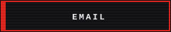
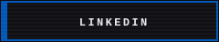
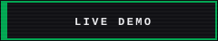
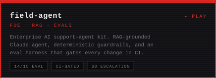
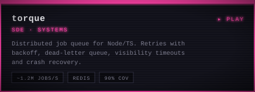
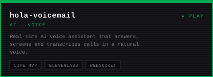
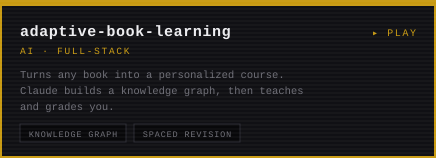
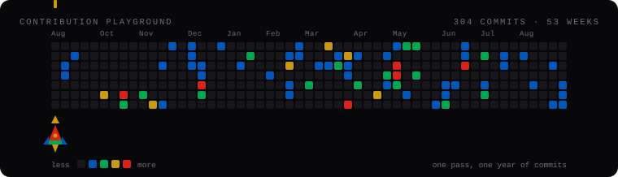

  

  <a href="mailto:lavtanotra@gmail.com"></a>
  <a href="https://www.linkedin.com/in/lavya-tanotra-50510a235/"></a>
  <a href="https://holavoicemail.com"></a>

  

<table width="100%">
<tr>
<td width="50%" align="center">
  <a href="https://github.com/LAVYA255/field-agent"></a>
</td>
<td width="50%" align="center">
  <a href="https://github.com/LAVYA255/torque"></a>
</td>
</tr>
<tr>
<td width="50%" align="center">
  <a href="https://github.com/LAVYA255/hola-voicemail"></a>
</td>
<td width="50%" align="center">
  <a href="https://github.com/LAVYA255/adaptive-book-learning"></a>
</td>
</tr>
</table>

  
    <a href="https://github.com/LAVYA255/relay">relay</a> ·
    <a href="https://github.com/LAVYA255/docuquery-rag">docuquery-rag</a> ·
    <a href="https://github.com/LAVYA255/typeahead-search">typeahead-search</a> ·
    <a href="https://github.com/LAVYA255/Drishti">Drishti</a> ·
    <a href="https://github.com/LAVYA255/lld-playground">lld-playground</a>
  

  

  

  

  

